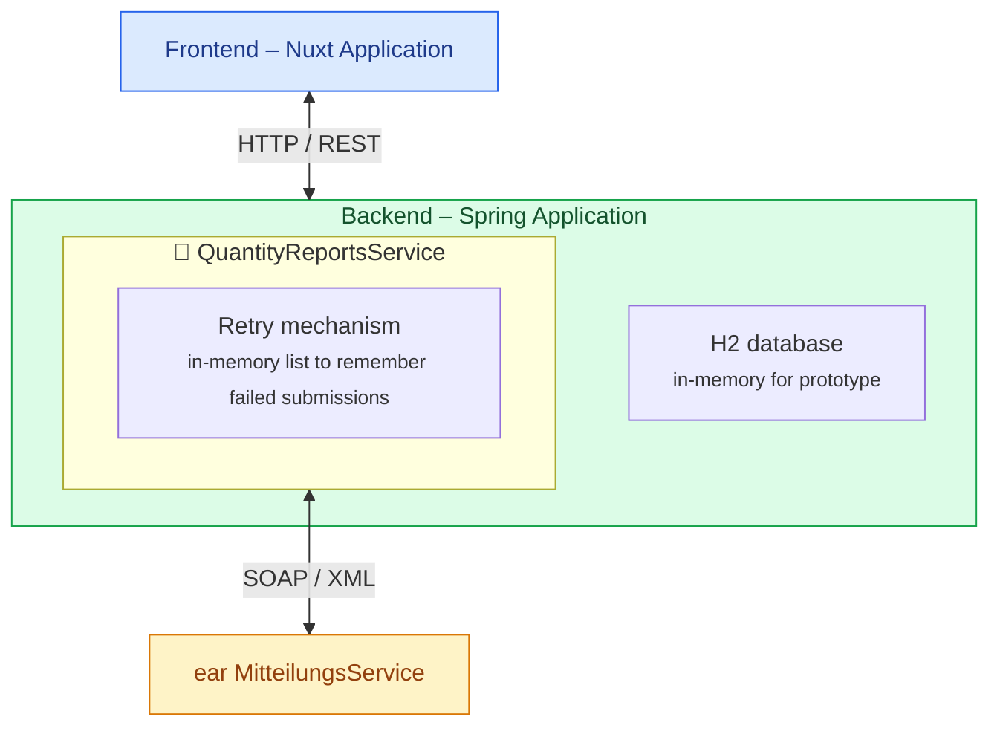
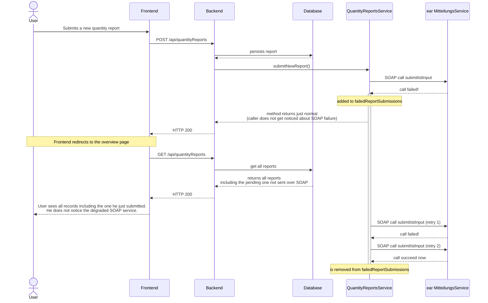

# Overall Architecture

```mermaid
flowchart TB
    FE["Frontend – Nuxt Application"]

    subgraph BE["Backend – Spring Application"]
        subgraph QRS["🫛 QuantityReportsService"]
            RETRY["Retry mechanism<br /><small>in-memory list to remember failed submissions</small>"]
        end
        
        DB["H2 database<br /><small>in-memory for prototype</small>"]
    end

    SOAP["ear MitteilungsService"]

    FE <-->|"HTTP / REST"| BE
    QRS <-->|"SOAP / XML"| SOAP

    classDef frontend fill:#dbeafe,stroke:#2563eb,color:#1e3a8a
    classDef backend fill:#dcfce7,stroke:#16a34a,color:#14532d
    classDef external fill:#fef3c7,stroke:#d97706,color:#92400e

    class FE frontend
    class BE,FS backend
    class SOAP external
```

# Workflow Submission to SOAP

Documents the submission of a quantity report by the user, when the SOAP web service does not work correctly.

```mermaid
sequenceDiagram
    actor User
    participant FE as Frontend
    participant BE as Backend
    participant DB as Database
    participant QRS as QuantityReportsService
    participant WS as ear MitteilungsService
    
    User->>FE: Submits a new quantity report
    FE->>BE: POST /api/quantityReports
    BE->>DB: persists report
    DB-->>BE: 
    BE->>QRS: submitNewReport()
    QRS->>WS: SOAP call submitIstInput
    WS-->>QRS: call failed!
    activate QRS
    Note over QRS: added to failedReportSubmissions
    QRS-->>BE: method returns just normal<br />(caller does not get noticed about SOAP failure)
    BE-->>FE: HTTP 200
    Note over User,FE: Frontend redirects to the overview page
    FE->>BE: GET /api/quantityReports
    BE->>DB: get all reports
    DB-->>BE: returns all reports<br />including the pending one not sent over SOAP
    BE-->>FE: HTTP 200
    FE-->>User: User sees all records including the one he just submitted.<br />He does not notice the degraded SOAP service.
    QRS->>WS: SOAP call submitIstInput (retry 1)
    WS-->>QRS: call failed!
    QRS->>WS: SOAP call submitIstInput (retry 2)
    WS-->>QRS: call succeed now
    Note over QRS: is removed from failedReportSubmissions
    deactivate QRS
```
